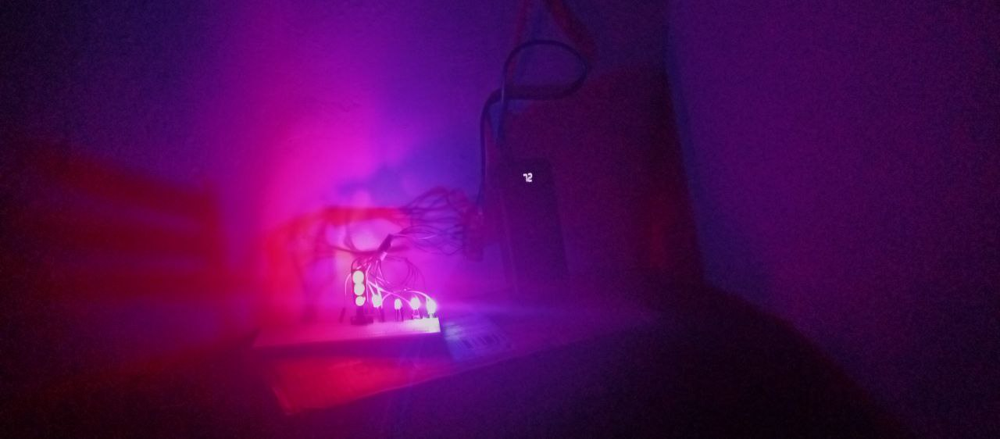

# Micropython | ESP32 Lite V1 with LED (1)

## Preparation Hardware

- Breadboard
- ESP 32 Lite V1
- 1 LED Traffic
- 1 LED Red
- 1 LED Yellow
- 1 LED Green
- 1 LED Blue
- 5 Cable Male To Male 
- 8 Cable Male To Female
- Usb Cable 
- Power-bank 

## Schematic 

| Module      | Pin    | ESP32 Lite V1 |
|-------------|--------|---------------|
| LED Traffic | Gnd    | Gnd           |
| LED Traffic | Red    | 5             |
| LED Traffic | Green  | 23            |
| LED Traffic | Yellow | 18            |
| LED Red     | +      | 19            |
| LED Red     | -      | Gnd           |
| LED Yellow  | +      | 16            |
| LED Yellow  | -      | Gnd           |
| LED Green   | +      | 17            |
| LED Green   | -      | Gnd           |
| LED Blue    | +      | 27            |
| LED Blue    | -      | Gnd           |

## Pictures
